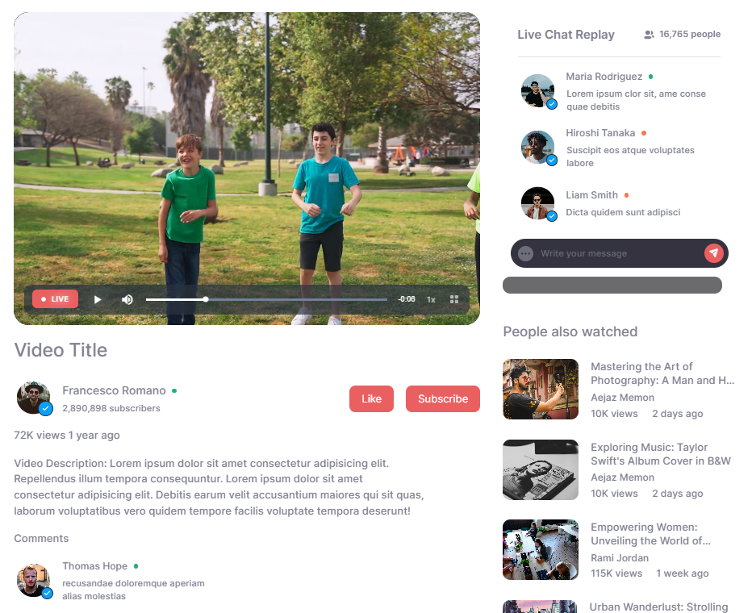
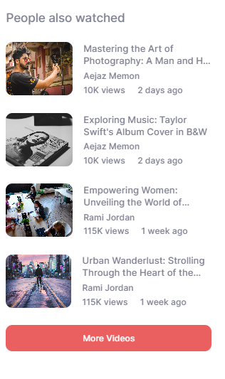

# Video Platform Concept

## Crafting an Intuitive and Aesthetically Pleasing Video Sharing Experience

In the digital era, video sharing platforms have reshaped the way we interact with media content, with giants like YouTube leading the way. Inspired by such platforms, a project was initiated to develop a dynamic video-sharing website called "Video Platform." This article explores the development process, highlighting the project's focus on enhancing user experience, aesthetic appeal, and functional accessibility to redefine the landscape of online video engagement.

### Seamless User Experience Redefined

The cornerstone of the Video Platform's design is a seamless and user-centric experience. The homepage welcomes users with a sleek interface that seamlessly integrates essential components such as a search bar, a discover segment featuring recommended videos, and a curated collection of popular content. This user-driven layout ensures that navigation is intuitive, enabling users to explore a diverse range of video categories effortlessly.

A standout feature is the carefully designed side panel, providing instant access to navigation menus and a selection of categories spanning technology, education, health, music, sports, and more. The thoughtful categorization enhances content discoverability, thus enriching the user journey on the platform.

### Aesthetic Pleasure Meets Functional Elegance

The Video Platform's aesthetic appeal seamlessly blends form and function. Drawing inspiration from the design principles that have been the foundation of successful platforms like YouTube, the project adopts a clean and modern interface. A soothing color palette serves as a backdrop, enhancing the visibility of video content while ensuring excellent readability.

The innovative hover-over video playback introduces an element of curiosity to the user experience. Videos play silently when hovered upon, enticing users to delve into content without disturbing their audio environment. This subtle yet powerful design element enhances both the platform's visual appeal and users' interaction with the content.

### Reviewing the Design through a Problem-Solving Lens

### 1.User Engagement and Navigation

The design effectively addresses the challenge of guiding users through content discovery. The presence of a search bar, discover segment, and popular content section on the homepage ensures easy access to diverse content. The side panel with categorized navigation further enhances user exploration.

### 2.Hover-Over Video Playback:

The implementation of videos playing silently on hover presents an innovative solution to enticing user engagement. This feature encourages users to explore content without interrupting their browsing experience, fostering curiosity and interaction.

### 3.Live Video Integration

The inclusion of live video broadcasts poses the challenge of seamless integration. The platform successfully overcomes this by employing real-time connections and interactive chat replay. This addition aligns with current trends and enhances user engagement.

### 4.Video Page Details:

The video page's layout effectively presents crucial information, much like established platforms. The clear presentation of video statistics, author details, and comments fosters user interaction, supporting the platform's social aspect.

### 5.Personalized Recommendations:

The rightmost side panel's recommendations for similar videos showcase thoughtful problem-solving. This algorithm-driven feature enhances user retention and interaction by offering tailored content choices.

### 6.Accessibility and Responsiveness:

The consideration of a responsive design reflects a problem-solving mindset. Ensuring consistent usability across various devices showcases an emphasis on accessibility.

### Conclusion

Inspired by platforms like YouTube, the Video Platform aims to enhance the user experience with easy-to-use design, appealing visuals, and practical accessibility. With the changing digital landscape, it aims to set the standard for intuitive design and a groundbreaking approach to online content engagement.
